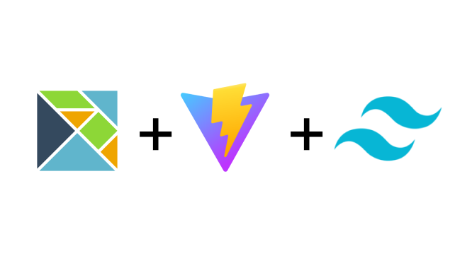

<a name="readme-top"></a>

<!-- PROJECT SHIELDS -->

[![Contributors][contributors-shield]][contributors-url]
[![Forks][forks-shield]][forks-url]
[![Stargazers][stars-shield]][stars-url]
[![Issues][issues-shield]][issues-url]
[![Apache 2.0 License][license-shield]][license-url]

<!-- PROJECT LOGO -->
<br />
<div align="center">
  <a href="/">
    
  </a>

  <h3 align="center">Elm Vite Template</h3>

  <p align="center">
    Minimalistic Elm Template powered by Vite!
    <br />
    <a href="https://elm-vite-template.vercel.app"><strong>View Demo »</strong></a>
    <br />
    <br />
    <a href="https://github.com/data-miner00/elm-vite-template">Explore the docs</a>
    ·
    <a href="https://github.com/data-miner00/elm-vite-template/issues">Report Bug</a>
    ·
    <a href="https://github.com/data-miner00/elm-vite-template/issues">Request Feature</a>
  </p>
</div>

<!-- TABLE OF CONTENTS -->
<details>
  <summary>Table of Contents</summary>
  <ol>
    <li>
      <a href="#about-the-project">About The Project</a>
      <ul>
        <li><a href="#built-with">Built With</a></li>
      </ul>
    </li>
    <li>
      <a href="#getting-started">Getting Started</a>
      <ul>
        <li><a href="#prerequisites">Prerequisites</a></li>
        <li><a href="#installation">Installation</a></li>
      </ul>
    </li>
    <li><a href="#usage">Usage</a></li>
    <li><a href="#roadmap">Roadmap</a></li>
    <li><a href="#contributing">Contributing</a></li>
    <li><a href="#license">License</a></li>
    <li><a href="#acknowledgments">Acknowledgments</a></li>
  </ol>
</details>

<!-- ABOUT THE PROJECT -->

## About The Project

<!--  -->

A simple and intuitive Elm template powered by Vite. Built in TailwindCSS and HMR. Focus on the application itself rather than all these low-level configuration stuffs.

Incentives:

- Could not find intuitive Elm starter templates
- The Elm development workflow is awkward
- Want to try out Elmish architecture
- Buitl this Elm template so I can use for other projects.

Of course, no one template will serve all projects since your needs may be different. So I'll be adding more in the near future. You may also suggest changes by forking this repo and creating a pull request or opening an issue. Thanks to all the people have contributed to expanding this template!

<p align="right">(<a href="#readme-top">back to top</a>)</p>

### Built With

The technologies and tools used within this template.

- Elm
- Vite
- TailwindCSS
- JavaScript

<p align="right">(<a href="#readme-top">back to top</a>)</p>

<!-- GETTING STARTED -->

## Getting Started

### Prerequisites

The list of tools that is used when development.

- npm
  ```sh
  npm install npm@latest -g
  ```
- Pnpm
  ```sh
  npm i -g pnpm
  ```
- [Git](https://git-scm.com/downloads)
- [Elm](https://elm-lang.org/)

### Installation

To use this template for personal use or contribution, simply perform the following.

1. Clone the repo
   ```sh
   git clone https://github.com/data-miner00/elm-vite-template.git
   ```
2. Install Node dependencies
   ```sh
   pnpm i
   ```
3. Optionally update the dependencies
   ```sh
   pnpm up --latest
   ```
4. Recommend to run tests to check if things are breaking
   ```sh
   pnpm test
   ```
5. Run formatter to format code
   ```sh
   pnpm format
   ```
6. Review Elm code quality
   ```sh
   pnpm review
   ```
7. Start dev server
   ```sh
   pnpm dev
   ```
8. Compile for production
   ```sh
   pnpm build
   ```
9. Preview production build
   ```sh
   pnpm preview
   ```
10. Start standalone Elm reactor
    ```sh
    pnpm elm:dev
    ```
11. Build standalone Elm code
    ```sh
    pnpm elm:build
    ```
12. Start interactive Elm shell
    ```sh
    pnpm repl
    ```

<p align="right">(<a href="#readme-top">back to top</a>)</p>

<!-- ROADMAP -->

## Roadmap

- [x] Add Homepage
- [ ] Add 404 page
- [ ] Dark mode
- [ ] Add GitHub workflows
- [ ] Add PWA Manifest
- [ ] Mobile Responsive
  - [ ] Navbar and header
- [ ] Add E2E tests

See the [open issues](https://github.com/data-miner00/elm-vite-template/issues) for a full list of proposed features (and known issues).

<p align="right">(<a href="#readme-top">back to top</a>)</p>

<!-- CONTRIBUTING -->

## Contributing

Contributions are what make the open source community such an amazing place to learn, inspire, and create. Any contributions you make are **greatly appreciated**.

If you have a suggestion that would make this better, please fork the repo and create a pull request. You can also simply open an issue with the tag "enhancement".
Don't forget to give the project a star! Thanks again!

1. Fork the Project
2. Create your Feature Branch (`git checkout -b feature/AmazingFeature`)
3. Commit your Changes (`git commit -m 'Add some AmazingFeature'`)
4. Push to the Branch (`git push origin feature/AmazingFeature`)
5. Open a Pull Request

<p align="right">(<a href="#readme-top">back to top</a>)</p>

<!-- LICENSE -->

## License

Distributed under the Apache 2.0 License. See `LICENSE` for more information.

<p align="right">(<a href="#readme-top">back to top</a>)</p>

<!-- ACKNOWLEDGMENTS -->

## Acknowledgments

List of resources that are helpful and would like to give credit to.

- [Elm Lang](https://elm-lang.org/)
- [Elm Packages](https://package.elm-lang.org/)
- [Vite Plugin Elm](https://github.com/hmsk/vite-plugin-elm/)
- [Vite Elm Template](https://github.com/lindsaykwardell/vite-elm-template)
- [Elm Spa Example](https://github.com/rtfeldman/elm-spa-example)
- [Elm Tooling](https://elm-tooling.github.io/elm-tooling-cli/)
- [Elm Parcel Template](https://github.com/kutyel/elm-parcel-template)
- [25 Elm Examples](https://github.com/bryanjenningz/25-elm-examples)
- [Elm Programming](https://elmprogramming.com/)
- [elm-test-rs](https://github.com/mpizenberg/elm-test-rs)
- [Elm Radio](https://elm-radio.com/)
- [Elm init next steps](https://github.com/elm/compiler/blob/master/hints/init.md)
- [elm-review](https://package.elm-lang.org/packages/jfmengels/elm-review/latest/)
- [Using Tailwind CSS in Elm and VSCode](https://max.hn/thoughts/using-tailwind-css-in-elm-and-vscode)
- [Getting Started with the Elm Programming Language](https://www.toptal.com/front-end/getting-started-elm-language)

<p align="right">(<a href="#readme-top">back to top</a>)</p>

<!-- MARKDOWN LINKS & IMAGES -->

[contributors-shield]: https://img.shields.io/github/contributors/data-miner00/elm-vite-template.svg?style=for-the-badge
[contributors-url]: https://github.com/data-miner00/elm-vite-template/graphs/contributors
[forks-shield]: https://img.shields.io/github/forks/data-miner00/elm-vite-template.svg?style=for-the-badge
[forks-url]: https://github.com/data-miner00/elm-vite-template/network/members
[stars-shield]: https://img.shields.io/github/stars/data-miner00/elm-vite-template.svg?style=for-the-badge
[stars-url]: https://github.com/data-miner00/elm-vite-template/stargazers
[issues-shield]: https://img.shields.io/github/issues/data-miner00/elm-vite-template.svg?style=for-the-badge
[issues-url]: https://github.com/data-miner00/elm-vite-template/issues
[license-shield]: https://img.shields.io/github/license/data-miner00/elm-vite-template.svg?style=for-the-badge
[license-url]: https://github.com/data-miner00/elm-vite-template/blob/master/LICENSE
